

    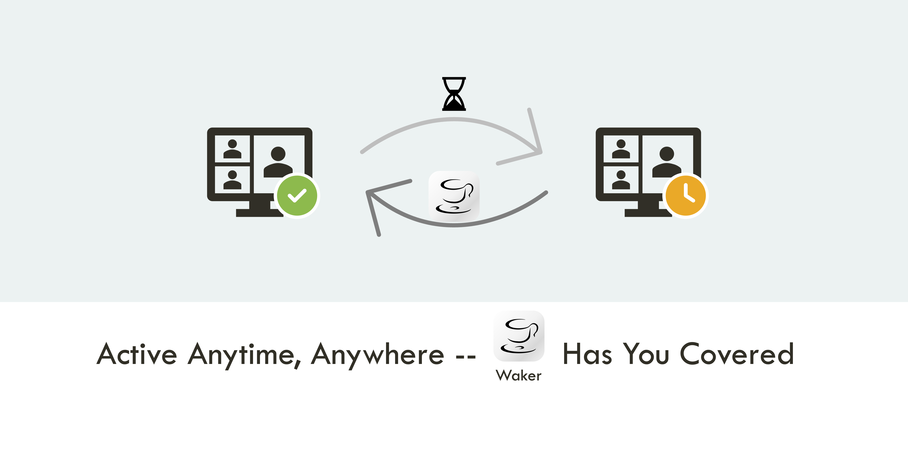

> "_You deserve a cup of coffee!_" - Waker  

A simple macOS menu bar app that helps you to keep your Mac awake and prevent "_You know what_" apps from becoming "**inactive**".

# Appearance
## Menu Bar Status

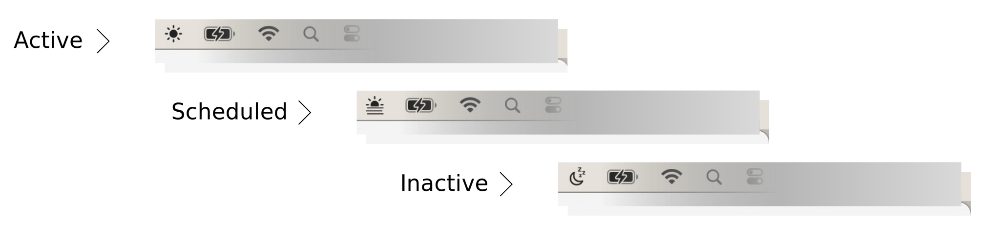

## Menu Body Appearance
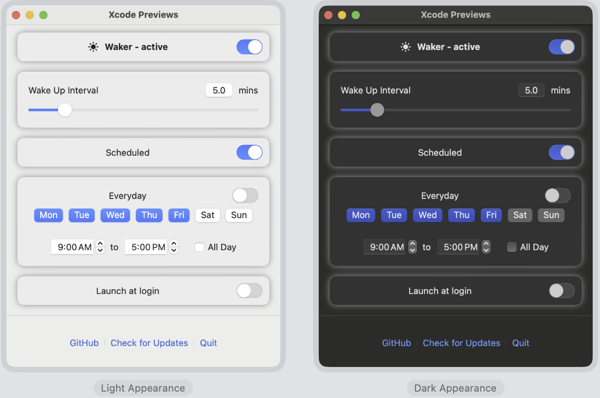

# Features

- **Keep Mac Awake**: Keep your Mac and related Apps awake and prevent it from becoming "inactive".
- **Set Wake Up Interval**: Set the interval to wake up your Mac.
- **Schedule Running Time**: Set a specific time to run Waker.
- **Auto-Start**: Automatically start Waker when you log in.
- **Dark Mode Support**: Support both light and dark mode.
- **Auto-Update**: Automatically check for updates and notify you when a new version is available.

# Installation

> [!WARNING]
> 1. As I don't have a paid Apple Developer account, this app is signed with a **development** certificate and not **notarized** by Apple.
> 
>    Due to the macOS security policy ([Safely open apps on your Mac](https://support.apple.com/en-us/102445)), you may need to do some extra steps to install and open the app.
> 
> 2. You just need to do the above steps **once**. After that, you can open the app from the `Launchpad` 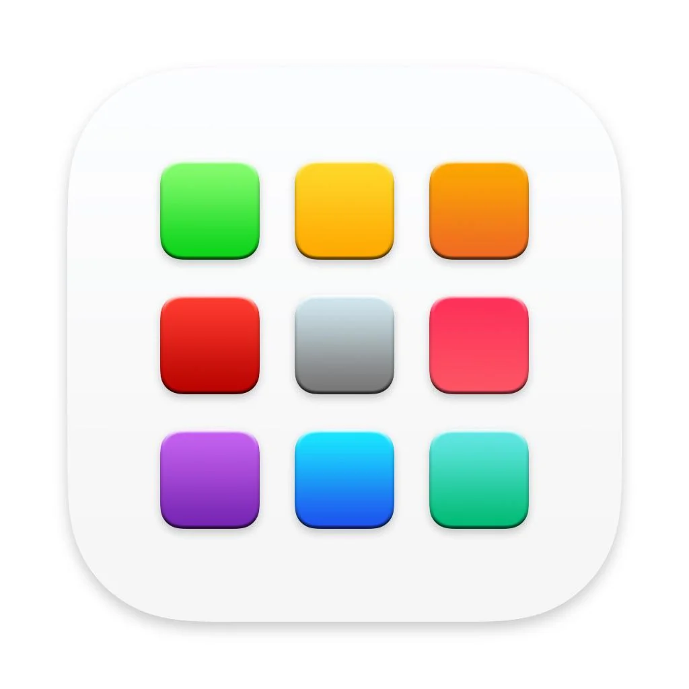 as usual.
>
>    The app can be updated automatically, but you will never see the above warning again unless you reinstall the app.
>
> 3. If you have any concerns about the security of this app, you can:
>    - Check the source code and build the app by yourself.
>    - Use the Python version I developed: [Waker](https://github.com/ChenglongMa/waker). Their core functionality is the same, just the user interface is slightly different.

  
<i>If you want to continue, click here...</i>

## Download

You can download the latest version of Waker `.dmg` installer from the [release page](https://github.com/ChenglongMa/waker-mac/releases/latest).

## Installation Steps

1. Please **right-click** the `.dmg` file and select `Open` to open the installer.
    - 🔴 If you **double-click** the `.dmg` file, you may encounter the following warning:
        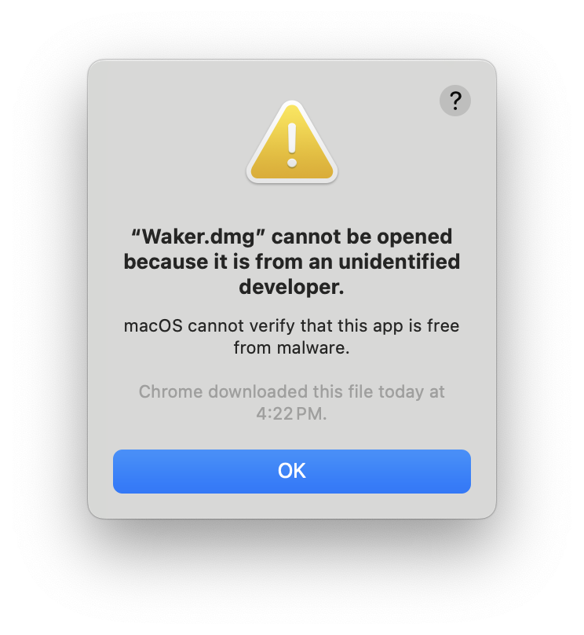
    - 🟢 When right-clicking the `.dmg` file, you will see the following warning, **please click `Open`**.
        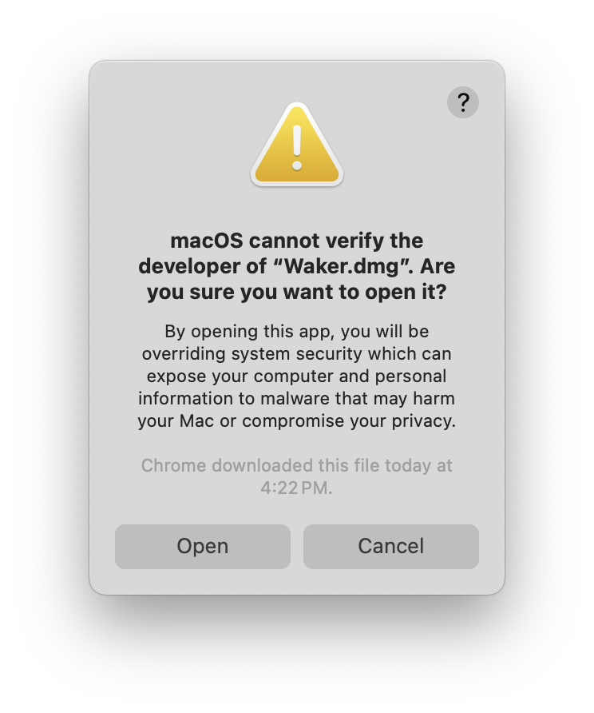
2. Please **drag** the `Waker.app` to the `Applications` folder.
    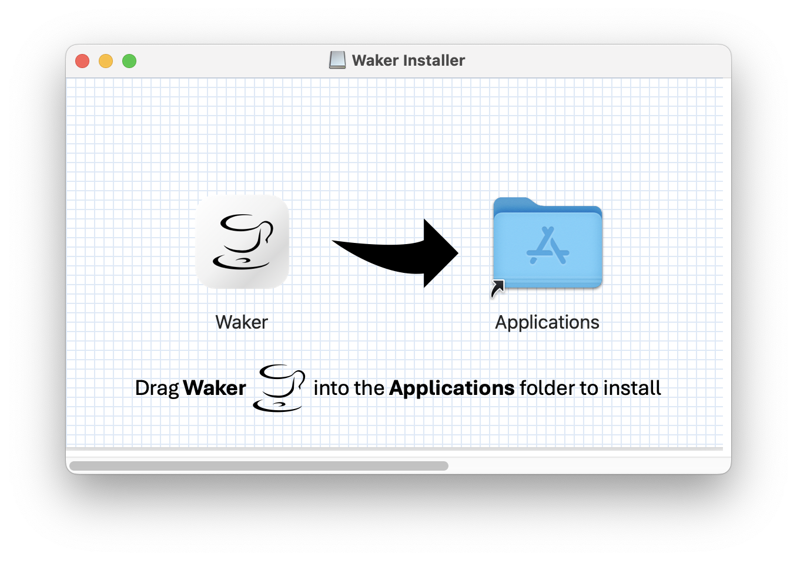
3. You will find the `Waker.app` in the `Launchpad`  or `Applications` folder.
    - 🔴 If you open the app from `Launchpad` , you will see the following warning, **please click `Show in Finder`**.
        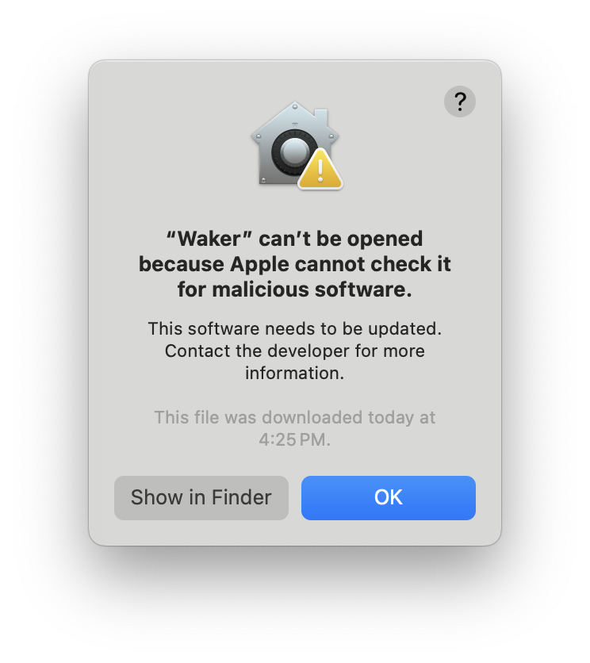
    - 🟢 Please **right-click** the app from the `Applications` folder and select `Open`, you will see the following warning, **Please click `Open`**.
        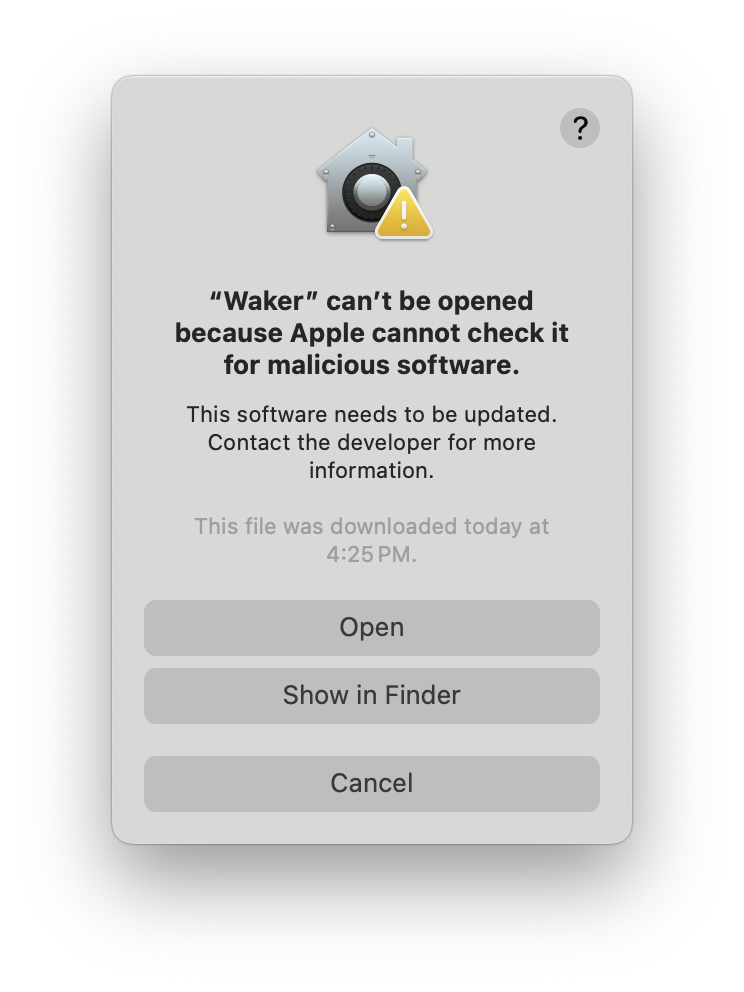
4. Finally, you can find the app in the menu bar, as shown in [Appearance Section](#appearance).
5. From now on, you can open the app from the `Launchpad`  as usual.

# Usage

The usage of the app is very straightforward and basically as it appears in its interface.

Here are some tips or reminders.

## Permissions

When you first open the app, you may need to grant some permissions to the app.

1. **Accessibility Permission** - You need to grant the app the **Accessibility** permission to enable the full functionality of the app.
    - You can follow the instructions in the app to grant the permission.
    - You can also do it manually following [this instruction](https://support.apple.com/en-au/guide/mac-help/mh43185/mac#:~:text=To%20review%20app%20permissions%20—%20for,any%20app%20in%20the%20list.).
        - Open the **System Settings**.
        - Go to **Privacy & Privacy**.
        - In the **Privacy** section, you can find the **Accessibility** settings.
        - You can toggle the switch to grant the permission to the app.
        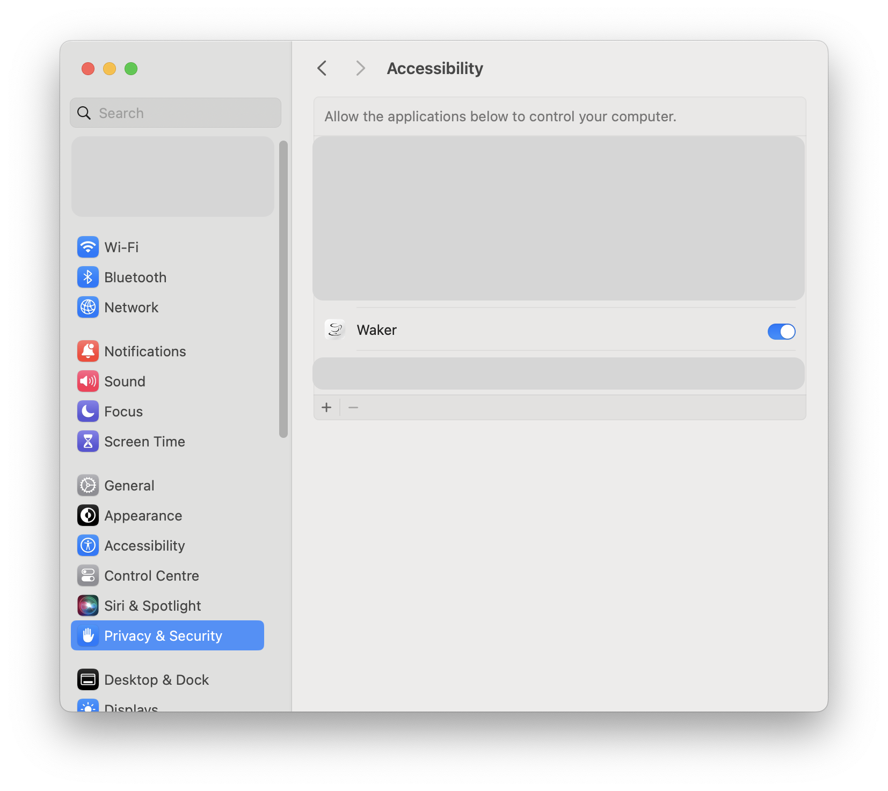
2. **Launch at Login** - You can enable the app to launch at login.
   - You can enable it in the app menu bar settings.
      1. Toggle the switch to enable the **Launch at Login**.
      2. You will see a prompt like:
        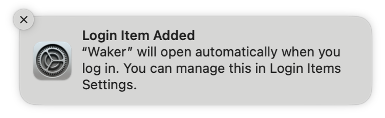
   - You can also do it manually following [this instruction](https://support.apple.com/en-au/guide/mac-help/mh15189/mac).
       - Open the **System Settings**.
       - Go to **General**.
       - In the **Login Items** section, you can add the app to the list.
       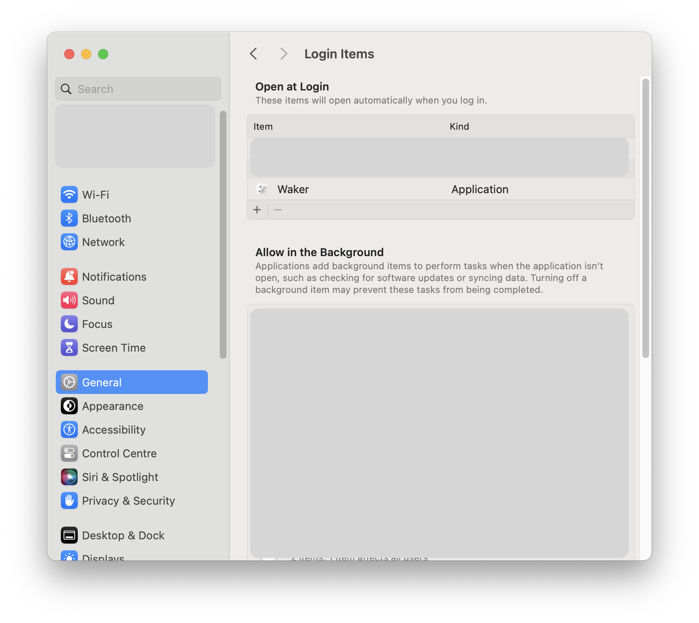
1. **Auto-Update** - You can enable the app to check for updates automatically.
   - You may need to grant **Notification** permission to the app.

## Functionality

### Manual Running

You can manually run the app by toggle the `Main Switch` in the app menu bar.

### Set Wake Up Interval

You can set the wake-up interval in the app menu bar settings.

Some apps would become inactive after **5 minutes**. You can set the wake-up interval to prevent them from becoming inactive.

### Schedule Running Time

You can set a specific time to run the app.

For example, you can set the app to run at **9:00 AM** and close at **5:00 PM** from **Monday** to **Friday**.

### Auto-Update

You can enable the app to check for updates automatically.

When a new version is available, you will receive a notification to update the app.

You can also check for updates manually in the app menu bar settings.

# Contributing

👋 Welcome to **Waker**! We're excited to have your contributions. Here's how you can get involved:

1. 💡 **Discuss New Ideas**: Have a creative idea or suggestion? Start a discussion in
   the [Discussions](https://github.com/ChenglongMa/waker-mac/discussions) tab to share your thoughts and
   gather feedback from the community.

2. ❓ **Ask Questions**: Got questions or need clarification on something in the repository? Feel free to open
   an [Issue](https://github.com/ChenglongMa/waker-mac/issues) labeled as a "question" or participate
   in [Discussions](https://github.com/ChenglongMa/waker-mac/discussions).

3. 🐛 **Issue a Bug**: If you've identified a bug or an issue with the code, please open a
   new [Issue](https://github.com/ChenglongMa/waker-mac/issues) with a clear description of the problem, steps
   to reproduce it, and your environment details.

4. ✨ **Introduce New Features**: Want to add a new feature or enhancement to the project? Fork the repository, create a
   new branch, and submit a [Pull Request](https://github.com/ChenglongMa/waker-mac/pulls) with your changes.
   Make sure to follow our contribution guidelines.

5. 💖 **Funding**: If you'd like to financially support the project, you can do so
   by [sponsoring the repository on GitHub](https://github.com/sponsors/ChenglongMa). Your contributions help us
   maintain and improve the project.

Thank you for considering contributing to **Waker**. 
We value your input and look forward to collaborating with you!
