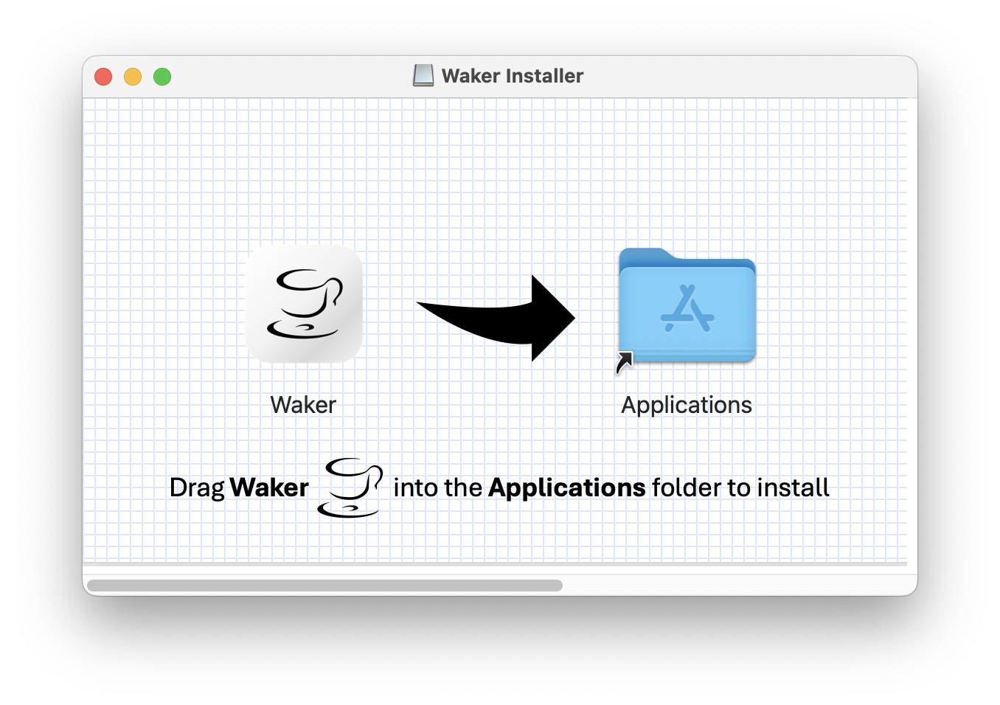

    <a href="./README.md">English</a> | 简体中文

> 
> "_嗨，不要着急，休息，休息一会儿！_" - Waker 

Waker是一个简单直接的macOS菜单栏应用，旨在保持你的Mac唤醒状态，防止某些应用（说的就是你，Teams）变成离开状态。

# 外观

## 菜单按钮状态

## 外观

# 主要功能

- **保持Mac唤醒**：防止你的Mac及相关应用进入**离开**状态。
- **设置唤醒间隔**：设置唤醒间隔时间。
- **计划运行时间**：设置Waker运行周期。
- **开机自启**：设置Waker登录时自动启动。
- **深色模式支持**：无缝切换浅色和深色模式。
- **自动更新**：自动检查更新，及时获取最新功能。

# 安装

> [!WARNING]
> 1. 由于我没有付费的Apple开发者账户（实在太贵了😥），这个app是用**开发者**证书签名的。详情请参阅 [在 Mac 上安全地打开 App](https://support.apple.com/zh-cn/102445)。
> 2. 由于 macOS 的安全策略，你可能会需要额外的安装步骤。这些步骤只需要执行一次，后续使用和其他应用程序一样。
> 3. 安装完成后，你可以自动更新应用程序而不会再次遇到此警告，除非你重新**下载**安装。
> 4. 如果你对这个应用程序的安全性有任何疑虑，你可以：
>    - 查看源代码并手动编译该 app。源代码完全开源并根据 [GPL-3.0 许可证](https://github.com/ChenglongMa/waker-mac/blob/main/LICENSE) 分发。
>    - 使用我（正在）开发的 Python 版本：[Waker](https://github.com/ChenglongMa/waker)。它们的核心功能是相同的，只是用户界面略有不同。
>

  
<i><b>如果没有疑虑，请单此继续。。。</b></i>

## 下载

请从[发布页面](https://github.com/ChenglongMa/waker-mac/releases/latest) 下载最新版本的Waker的 `.dmg` 安装程序。

## 安装步骤

1. **右键单击** `.dmg` 文件，然后选择 `打开` 开始安装过程。
    - 🟢 右键单击打开该 `.dmb` 文件后，你会看到以下警告，请单击 `打开`。（*由于我用的是英文系统，所以截图皆为英文*）
      
    - 🔴 但如果你是**双击**安装，你可能会收到以下警告：
      
2. 在安装界面，请将 `Waker.app` 拖到 `应用程序`(`Applications`) 文件夹中。
   
3. 从 `启动器`(`Launchpad`)  或 `应用程序`(`Applications`) 文件夹中找到 `Waker.app`。如果你从 `启动器` 打开应用程序时遇到警告，请点击 `在 Finder 中显示` 并继续。
    - 🟢 请从 `应用程序` 文件夹中**右键单击**应用程序并选择 `打开`。你会看到以下警告，请单击 `打开`。
      
    - 🔴 如果你从 `启动器`(`Launchpad`)  打开应用程序时遇到警告，**请点击 `在 Finder 中显示`**。
      
4. 现在，你可以在菜单栏中找到该应用程序，如[外观部分](#外观)所示。
5. 从现在起，你可以像往常一样从 `启动器`  打开应用程序。

# 用法

Waker 的使用方法非常直观，所见即所得。以下是一些小小的提示，以帮助你更好地使用该应用程序。

## 所需权限

在首次启动时，你可能需要授予Waker一些权限：

1. **Accessibility Permission**（译作**辅助功能**？）: 请授予该应用程序**辅助功能**权限以启用其全部功能。
    - 您可以在首次启动应用程序时按照提示操作。
    - 或者，您可以通过系统设置 > 隐私与安全性 > 辅助功能 进行手动操作。请参考[此说明](https://support.apple.com/zh-cn/guide/mac-help/mh43185/mac)。
      

2. **开机时自启**: 启用该功能后，Waker 将在登录时自动启动。让您可以无缝摸鱼🎣。

    - 你可以在该 app 中切换此设置。
    - 也可以通过系统设置 > 用户与群组 > 登录项 进行手动操作。
      

3. **自动更新**: 授予该应用程序**通知**权限以接收自动更新通知。

## 主要功能

### 手动运行

在菜单栏中切换 `主开关` 以手动运行或停止 Waker。

### 设置唤醒间隔

在菜单栏中设置唤醒间隔，以防止某些应用程序变为非活动状态（比如**离开**）。Teams 自动转入离开状态的间隔为**5分钟**，所以建议设置小于等于**5分钟**的时间。

### 定时运行

设置 Waker 运行的时间周期，根据你的偏好和工作流程进行自定义使用。

比如，你可以设置该应用程序在**周一**到**周五**的**上午9:00**运行并在**下午5:00**关闭。**996** 打工仔请自觉绕道😂。

### 自动更新

开启自动更新检查以获取最新版本的 Waker。

当然，你也可以手动单击菜单栏中的 `检查更新` 按钮检查更新。

# 开源贡献

👋 欢迎关注 **Waker**！很高兴有你的参与。以下是你可以参与的方式：

1. 💡 **讨论新想法**：有创意的想法或建议？在[Discussion](https://github.com/ChenglongMa/waker-mac/discussions)页面开始讨论，分享你的想法并从获得反馈。

2. ❓ **提问**：对仓库中的某些内容有疑问？随时开一个标记为“问题”的[issue](https://github.com/ChenglongMa/waker-mac/issues)或参与[Discussion](https://github.com/ChenglongMa/waker-mac/discussions)。

3. 🐛 **报告错误**：如果你发现了一个bug，请开一个新的[issue](https://github.com/ChenglongMa/waker-mac/issues)，并清楚描述问题、复现步骤以及你的运行环境。

4. ✨ **引入新功能**：想要为项目添加新功能或增强吗？Fork仓库，创建一个新分支，并提交一个带有你更改的[PR](https://github.com/ChenglongMa/waker-mac/pulls)。确保遵循我们的贡献指南。

5. 💖 **赞助**：如果您想更多地支持该项目，你可以通过[在GitHub上赞助仓库](https://github.com/sponsors/ChenglongMa)来实现。感谢各位金主大佬！

非常感谢各位对 **Waker** 的关注和支持！🙏